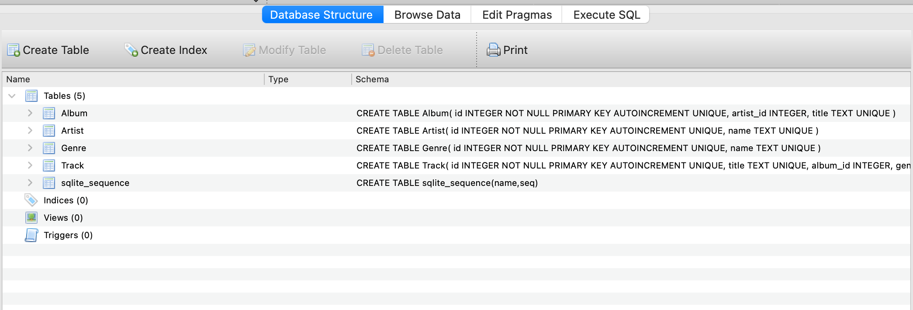
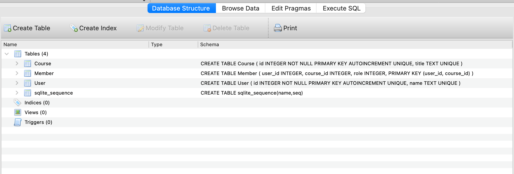

# SQLDatabasesWithPython
By Qidu(Quentin) Fu

## Outline
- [1 Introduction](#1)
- [2 Methodology](#2)
- [3 Results](#3)
  - [3.1 Project 1](#3.1)
  - [3.2 Project 2](#3.2)
- [Acknowledgements](#4)

## 1 Introduction 
These repository includes two projects, specifically, these two project aim for the tasks below respectively:
- project1 (multi-table databases): Build and join tables/database to organize musical tracks with artists, albums, and genres on the [give dataset](http://www.py4e.com/code3/tracks.zip)
- project2 (mapping students and classes): Build and join tables/dataset to organize students/classes memberships on the [given dataset](https://www.py4e.com/tools/sql-intro/roster_data.php?PHPSESSID=3d761449819ed661d68425bb071933cb)

## Methodology
To complete the aformentioned tasks, my project code files:
- (project 1) read an iTunes export file in XML and produce a properly normalized database
- (project 2) read roster data in JSON format, parse the file, and then produce an SQLite database that contains a User, Course, and Member table and populate the tables

## Results 
Content below presents and visualizes the answers to the questions in the introduction. 

### 3.1 Project 1
Project 1 read an iTunes export file in XML and produce a properly normalized database

**Image 1**

### 3.2 Project 2
Project 2 read roster data in JSON format, parse the file, and then produce an SQLite database that contains a User, Course, and Member table and populate the tables

**Image 2**

## Acknowledgements
These are assignments completed for the coursera course: Using Databases with Python by Charles Russell Severance
